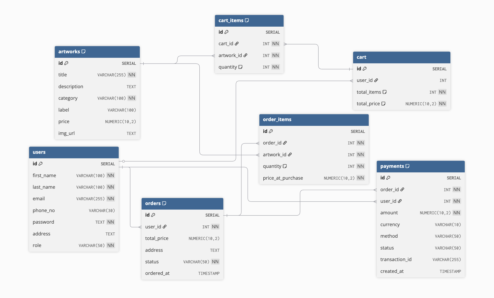

# Online Art Gallery

## Concept

An online art gallery where you can **browse, order, and purchase artworks**. And the **owner** can manage the contents (artworks, orders, etc.)

## Tools & Technologies

- **Backend:** Java, SpringBoot
- **Database & Storage:** PostgreSQL, Supabase
- **Authentication & Security:** JWT
- **Email Service:** SendGrid (for user verification)
- **Payments:** Stripe
- **Containerization:** Docker

## Database

### Schema

## Backend

### Codebase Structure

DB -> Repositories -> Services -> DTOs -> Controllers & Routes

## Environment Variables

#### Database Configuration

- `DB_URL`=your_db_url
- `DB_USER`=your_db_user
- `DB_PASSWORD`=your_db_password

#### Security & JWT

- `JWT_SECRET`=your_jwt_secret_key_min_32_chars
- `JWT_EXPIRATION_MS`=time in ms

#### Email Service (SendGrid)

- `EMAIL_HOST`=smtp.sendgrid.net
- `EMAIL_PORT`=587
- `EMAIL_FROM`=your_verified_email@domain.com
- `SENDGRID_API_KEY`=SG.your_api_key

#### Payment Gateway (Stripe)

- `STRIPE_API_KEY`=sk_test_your_key
- `STRIPE_WEBHOOK_SECRET`=whsec_your_secret

#### Cloud Storage (Supabase)

- `SUPABASE_STORAGE_URL`=https://your-project.supabase.co
- `SUPABASE_STORAGE_KEY`=your_service_role_key
- `SUPABASE_STORAGE_BUCKET`=artworks (or the name of the bucket in your supabase storage)

## Getting Started

### Inside backend folder

#### Install dependencies

`./mvn clean install`

#### Run application

`./mvn spring-boot:run`
(Note: Do not forget the environment variables)

#### With Docker

Create .env file inside backend folder and put all the environment variables.

Run the command (Note: You should be inside backend folder)
`docker compose up --build`

## API ENDPOINTS

### Authentication

**Base Path:** `/api/auth`

- `POST /login` Public — Authenticate user and receive a JWT token.

### User

**Base Path:** `/api/users`

- `POST /` OWNER — Administrative creation of a new user.
- `POST /register` Public — Self-registration for new users.
- `POST /verify` Public — Verify registration using an email code.
- `POST /resend-verification` Public — Request a new verification code.
- `PUT /{id}` Self / OWNER — Update user profile details.
- `PATCH /{id}/role` OWNER — Change a user's role.
- `GET /` OWNER — Retrieve a list of all registered users.
- `GET /{id}` Self / OWNER — Fetch a specific user's profile by ID.
- `GET /email/{email}` Self / OWNER — Fetch a specific user's profile by email.
- `GET /exists/{email}` Public — Check if an email is already registered.
- `DELETE /{id}` Self / OWNER — Delete a user account.

### Artwork

**Base Path:** `/api/artworks`

- `POST /` OWNER — Upload new artwork with image and metadata.
- `GET /{id}` Public — Get detailed information for a specific piece.
- `GET /` Public — Retrieve all available artworks.
- `GET /category/{category}` Public — Filter artworks by category.
- `DELETE /{id}` OWNER — Permanently remove an artwork.

### Cart & Cart Items

**Base Path:** `/api/carts | /api/cart-items`

- `POST /api/carts` Self / OWNER — Create a new shopping cart for a user.
- `GET /api/carts/{id}` Self / OWNER — View cart contents by cart ID.
- `GET /api/carts/user/{userId}` Self / OWNER — View cart contents by user ID.
- `DELETE /api/carts/{id}` Self / OWNER — Delete an entire cart.
- `POST /api/cart-items` Self / OWNER — Add an artwork to the cart.
- `GET /api/cart-items/cart/{id}` Self / OWNER — View all items within a specific cart.
- `PATCH /api/cart-items/{id}/increase` Self / OWNER — Increase item quantity.
- `PATCH /api/cart-items/{id}/decrease` Self / OWNER — Decrease item quantity.
- `DELETE /api/cart-items/{id}` Self / OWNER — Remove a specific item from the cart.

### Orders

**Base Path:** `/api/orders`

- `POST /` Authenticated — Place a new order from current cart.
- `GET /{id}` Self / OWNER — Retrieve order details.
- `GET /user/{userId}` Self / OWNER — List all orders for a specific user.
- `GET /` OWNER — List all orders in the system.
- `POST /{id}/confirm` OWNER — Mark order as confirmed.
- `POST /{id}/ship` OWNER — Mark order as shipped.
- `POST /{id}/deliver` OWNER — Mark order as delivered.
- `POST /{id}/cancel` Self / OWNER — Cancel a pending or active order.
- `DELETE /{id}` OWNER — Administrative deletion of an order.

### Payment & Webhooks

**Base Path:** `/api/payments | /api/stripe`

- `POST /api/payments` Self / OWNER — Initiate a Stripe Payment Intent.
- `GET /api/payments/order/{id}` Self / OWNER — Fetch payment status for an order.
- `GET /api/payments/payment-statuses` OWNER — List all possible payment statuses.
- `DELETE /api/payments/{id}` OWNER — Delete a payment record.
- `POST /api/stripe/webhook` Public (Stripe) — Handle Stripe payment success/failure events.

### Metadata

**Base Path:** `/api/meta`

- `GET /art-categories` Public — Retrieve list of all valid art categories.
